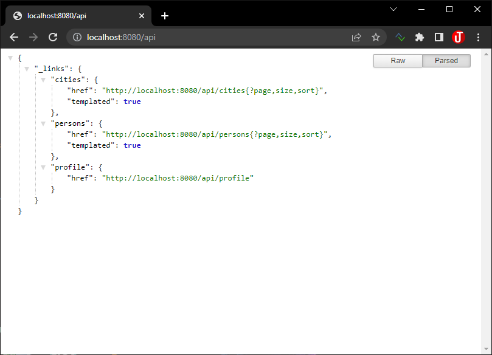
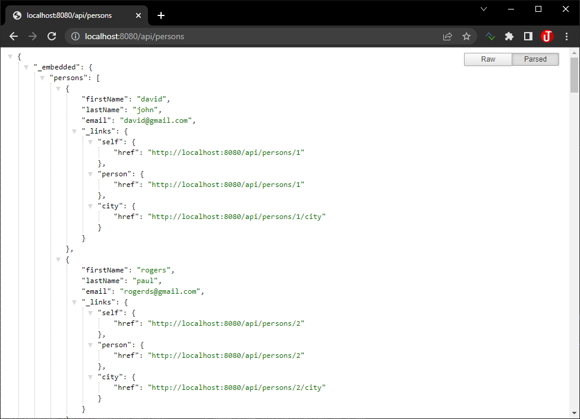
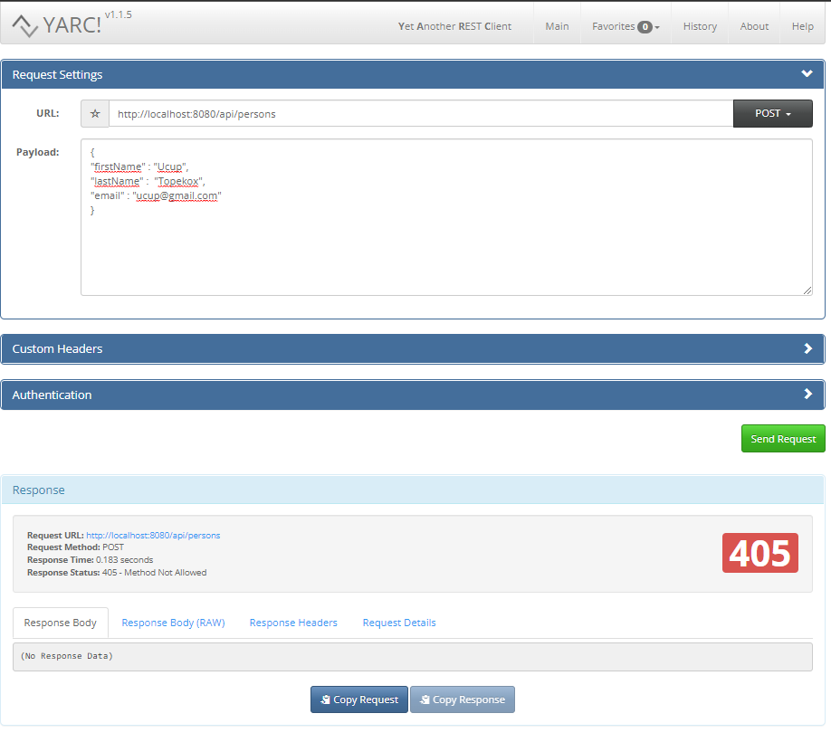

Pada seri tutorial ini kita akan membangun aplikasi *Fullstack* Spring Boot sebagai *backend* dan Angular sebagai *frontend*. Fullstack developer secara garis besar adalah seseorang yang bekerja atau merangkap tugas sebagai back end dan front end developer. Lebih spesifiknya, developer bisa bekerja dengan aplikasi backend seperti Javascript, PHP, Go, Java, Database (backend) dan juga bisa mengkonversi desain ke dalam kode pemrograman seperti HTML, CSS, XML, JSON (frontend).

<!--truncate-->

:::info
Aplikasi yang akan dibuat hanya untuk menampilkan data READ ONLY, aplikasi ini tidak mendukung Create, Update dan Delete.
:::

## Teknologi Yang Digunakan

Adapun teknologi yang digunakan adalah:

1. Spring Boot (backend)
2. Angular (frontend)
3. MySQL (database)

## Pengetahuan yang dibutuhkan

* Java Basic
* Spring Framework Basic
* Angular dasar
* Typescript & Javascript dasar
* HTML & CSS / Bootstrap

## Tools yang digunakan

Adapun tools yang digunakan pada tutorial ini:

* [OpenJDK 17](https://jdk.java.net/archive/)
* [Node Js & npm](https://nodejs.org/en/download/)
* Angular 13
* [Maven 3.8](https://maven.apache.org/download.cgi)
* [MySQL Database](https://www.mysql.com/downloads/)

Untuk IDE nya saya menggunakan (bisa menggunakan IDE lain sesuai selera):
* Intellij IDEA Community - untuk coding Spring Boot
* VS Code - untuk coding Angular

## Proses Development

Adapun step-by-step proses development:

1. Menyiapkan Database
2. Membuat Aplikasi Spring Boot untuk Backend
	* Membuat Entity
	* Membuat Repository Data Access Object.
	* Menampilkan data REST.
3. Membuat Aplikasi Angular untuk Frontend
	* Membuat model.
	* Membuat component.
	* Membuat service.

## Arsitektur Aplikasi

Gambaran umum desain arsitektur aplikasi yang akan kita buat:


## Konfigurasi MySQL

Disini saya akan membuat database dengan nama `belajar`:

```sql
CREATE DATABASE belajar;

USE belajar;
```

Kemudian dalam praktek ini kita akan menyiapkan database dengan tabel `person` dan `city` yang akan berelasi one-to-many antara 2 tabel, dengan rancangan relasi seperti gambar di bawah ini.


Untuk datanya tidak usah khawatir, saya sudah menyiapkan file dump `sql` nya

Untuk tabel `city` :

```sql title="Tabel City"
DROP TABLE IF EXISTS `city`;
CREATE TABLE `city` (
  `id` int NOT NULL AUTO_INCREMENT,
  `city_name` varchar(100) CHARACTER SET utf8mb4 COLLATE utf8mb4_0900_ai_ci NOT NULL,
  PRIMARY KEY (`id`),
  KEY `course_id_IDX` (`id`) USING BTREE
) ENGINE=InnoDB AUTO_INCREMENT=6 DEFAULT CHARSET=utf8mb4 COLLATE=utf8mb4_0900_ai_ci;

LOCK TABLES `city` WRITE;

INSERT INTO `city` VALUES (1,'Jakarta'),(2,'Makassar'),(3,'Medan'),(4,'Surabaya'),(5,'Ambon');

UNLOCK TABLES;
```

Untuk tabel `person` dengan 50 record data:

```sql title="Tabel Person"
DROP TABLE IF EXISTS `person`;

CREATE TABLE `person` (
  `id` int NOT NULL AUTO_INCREMENT,
  `first_name` varchar(100) DEFAULT NULL,
  `last_name` varchar(100) DEFAULT NULL,
  `email` varchar(100) DEFAULT NULL,
  `id_city` int DEFAULT NULL,
  PRIMARY KEY (`id`),
  KEY `person_FK` (`id_city`),
  CONSTRAINT `person_FK` FOREIGN KEY (`id_city`) REFERENCES `city` (`id`)
) ENGINE=InnoDB AUTO_INCREMENT=51 DEFAULT CHARSET=utf8mb4 COLLATE=utf8mb4_0900_ai_ci;

LOCK TABLES `person` WRITE;

INSERT INTO `person` VALUES (1,'david','john','david@gmail.com',1),(2,'rogers','paul','rogerds@gmail.com',1),(3,'maria','sanders','maria@gmail.com',1),(4,'morris','miller','morris@gmail.com',1),(5,'azwar','anas','azwar@gmail.com',1),(6,'daniel','michael','daniel01@gmail.com',1),(7,'sanders','paul','sanders45@gmail.com',1),(8,'mark','mike','mark55@gmail.com',1),(9,'morgan','maria','morgan22@gmail.com',2),(10,'paul','miller','paul45@gmail.com',2),(11,'david','miller','david33@gmail.com',2),(12,'chrishaydon','bell','chrishaydon22@gmail.com',2),(13,'michael','brown','112michael@gmail.com',2),(14,'morgan','james','222morgan@gmail.com',2),(15,'rogers','chrishaydon','rogers34@gmail.com',2),(16,'morgan','wright','morgan2232@gmail.com',2),(17,'morgan','wright','morgan22223@gmail.com',2),(18,'david','ross','david222@gmail.com',2),(19,'maria','morgan','maria434@gmail.com',2),(20,'mike','bell','mike66@gmail.com',2),(21,'miller','michael','miller232@gmail.com',3),(22,'ross','rogers','ross56@gmail.com',3),(23,'brooks','mike','brooks232@gmail.com',3),(24,'miller','daniel','miller444@gmail.com',3),(25,'mike','wright','mike333@gmail.com',3),(26,'wright','smith','wright3242@gmail.com',3),(27,'david','morgan','david111@gmail.com',3),(28,'smith','bell','smith66868@gmail.com',3),(29,'paul','wright','paul456464@gmail.com',3),(30,'michael','james','michael6868@gmail.com',3),(31,'michael','sanders','michael55765@gmail.com',4),(32,'john','rivera','johnrrr44@gmail.com',4),(33,'paul','michael','paul33553@gmail.com',4),(34,'ross','mark','ross87989@gmail.com',4),(35,'brooks','smith','brooks223322@gmail.com',4),(36,'cooper','brown','cooper90909@gmail.com',4),(37,'ross','daniel','ross12121@gmail.com',4),(38,'cooper','miller','cooper6767@gmail.com',4),(39,'jenny','maria','jenny12121@gmail.com',4),(40,'paul','rivera','paul46646@gmail.com',4),(41,'maria','sanders','maria131313@gmail.com',5),(42,'bell','david','bell21242@gmail.com',5),(43,'rivera','cooper','rivera574754@gmail.com',5),(44,'mark','david','markwffw24@gmail.com',5),(45,'paul','cooper','paul56454@gmail.com',5),(46,'brooks','david','brooks53545@gmail.com',5),(47,'james','maria','james656@gmail.com',5),(48,'john','mark','john6786@gmail.com',5),(49,'rivera','jenny09','rivera121212@gmail.com',5),(50,'chrishaydon','sanders','chrishaydon21232@gmail.com',5);

UNLOCK TABLES;

```

Cek datanya untuk memastikan datanya sudah ada:

```sql
SELECT * FROM city;

SELECT * FROM person;
```

## Spring Boot Back End

Di artikel kita membuat project Spring Boot yang hanya akan membuat aplikasi dengan studi kasus untuk menampilkan data READ ONLY, aplikasi ini tidak mendukung Create, Update dan Delete.

Kita akan membuat backend API dengan Spring boot yang akan mengenerate:

| Method      | URL                   | Keterangan                          |
| ----------- | -----------           | ---                                 |
| GET         | `/api/users`            | menampilkan data users            |
| GET         | `/api/users/:id`        | menampilkan data user berdasarkan **id** |
| GET         | `/api/users/search=:keyword`   | menampilkan data user berdasarkan **keyword** |
| GET         | `/api/citys/:id`        | menampilkan data user berdasarkan **id_city** |

Kita akan memanggil data dari database menggunakan Spring Data REST JPA `JpaRepository`, sehingga kita bisa membuat kodingan kita jauh lebih simpel. 

### Setup Project

Buat Project menggunakan [Spring web tool](https://start.spring.io/) atau melalui IDE (Spring Tool Suite, Eclipse, Intellij) untuk membuat Spring Boot project.

### Dependency

Dependency yang digunakan dalam project ini:

* Spring REST Repository
* Spring Data JPA
* MySQL Driver
* Lombok

Struktur direktori project:


Isi dependency dalam maven file di `pom.xml`

```xml title=pom.xml
<?xml version="1.0" encoding="UTF-8"?>
<project xmlns="http://maven.apache.org/POM/4.0.0" xmlns:xsi="http://www.w3.org/2001/XMLSchema-instance"
  xsi:schemaLocation="http://maven.apache.org/POM/4.0.0 https://maven.apache.org/xsd/maven-4.0.0.xsd">
  <modelVersion>4.0.0</modelVersion>
  <parent>
    <groupId>org.springframework.boot</groupId>
    <artifactId>spring-boot-starter-parent</artifactId>
    <version>2.6.7</version>
    <relativePath/> <!-- lookup parent from repository -->
  </parent>
  <groupId>com.tutorialtimposu</groupId>
  <artifactId>springboot-backend</artifactId>
  <version>0.0.1-SNAPSHOT</version>
  <name>springboot-backend</name>
  <description>Spring Boot Backend</description>
  <properties>
    <java.version>17</java.version>
  </properties>
  <dependencies>
    <dependency>
      <groupId>org.springframework.boot</groupId>
      <artifactId>spring-boot-starter-data-rest</artifactId>
    </dependency>

    <dependency>
      <groupId>mysql</groupId>
      <artifactId>mysql-connector-java</artifactId>
      <scope>runtime</scope>
    </dependency>
    <dependency>
      <groupId>org.projectlombok</groupId>
      <artifactId>lombok</artifactId>
      <optional>true</optional>
    </dependency>
    <dependency>
      <groupId>org.springframework.boot</groupId>
      <artifactId>spring-boot-starter-test</artifactId>
      <scope>test</scope>
    </dependency>
  </dependencies>

  <build>
    <plugins>
      <plugin>
        <groupId>org.springframework.boot</groupId>
        <artifactId>spring-boot-maven-plugin</artifactId>
        <configuration>
          <excludes>
            <exclude>
              <groupId>org.projectlombok</groupId>
              <artifactId>lombok</artifactId>
            </exclude>
          </excludes>
        </configuration>
      </plugin>
    </plugins>
  </build>

</project>
```

### Konfigurasi File Properties Spring Datasource, JPA dan Hibernate

Tambahkan line dibawah ini ke dalam file `application.properties` yang berada di folder `src/main/resources`.

```properties title=application.properties
# jdbc properties
spring.datasource.driver-class-name=com.mysql.cj.jdbc.Driver
spring.datasource.url=jdbc:mysql://localhost:3306/belajar
spring.datasource.username=ucup
spring.datasource.password=******

# hibernate properties
spring.jpa.properties.hibernate.dialect=org.hibernate.dialect.MySQL8Dialect

# custom base path url
spring.data.rest.base-path=/api
```

Selain konfigurasi ke database kita juga set base-path urlnya ke `/api`.

### Membuat Entity / Model

Kita akan membuat dua entity ke dalam package `entity` berdasarkan tabel yang telah kita buat yaitu tabel `person` dan `city` .

```java title=City.java
package com.tutorialtimposu.backend.entity;

import lombok.Data;

import javax.persistence.*;
import java.util.Set;

@Entity
@Table(name = "city")
@Data
public class City {

    @Id
    @GeneratedValue(strategy = GenerationType.IDENTITY)
    @Column(name = "id")
    private Long id;

    @Column(name = "city_name")
    private String cityName;

    @OneToMany(cascade = {
            CascadeType.DETACH,
            CascadeType.MERGE,
            CascadeType.REFRESH,
            CascadeType.PERSIST,
    }, mappedBy = "city")
    private Set<Person> person;

}
```

```java title=Person.java
package com.tutorialtimposu.backend.entity;

import lombok.Data;

import javax.persistence.*;

@Entity
@Table(name = "person")
@Data
public class Person {

    @Id
    @GeneratedValue(strategy = GenerationType.IDENTITY)
    @Column(name = "id")
    private Long id;

    @Column(name = "first_name")
    private String firstName;

    @Column(name = "last_name")
    private String lastName;

    @Column(name = "email")
    private String email;

    @ManyToOne(cascade = {
            CascadeType.DETACH,
            CascadeType.MERGE,
            CascadeType.REFRESH,
            CascadeType.PERSIST
    })
    @JoinColumn(name = "id_city")
    private City city;

}
```

Perhatikan pada bagian `cascade` di situ saya tidak mendefiniskan ke `all` karena kita memiliki 2 tabel yang berelasi dan kita tidak ingin agar jika data dihapus disalah satu tabel maka berpengaruh ke tabel lainnya, makanya saya mendefinisikan `cascade` nya secara manual dengan tidak memasukan `cascade` dengan tipe `CascadeType.REMOVE`.

### Membuat Repository

Kemudian kita akan membuat dua Repository DAO untuk masing-masing entity ke dalam package `dao`.

```java title=CityRepository.java
package com.tutorialtimposu.backend.dao;

import com.tutorialtimposu.backend.entity.City;
import org.springframework.data.jpa.repository.JpaRepository;

public interface CityRepository extends JpaRepository<City, Long> {
}
```

```java title=PersonRepository
package com.tutorialtimposu.backend.dao;

import com.tutorialtimposu.backend.entity.Person;
import org.springframework.data.jpa.repository.JpaRepository;

public interface PersonRepository extends JpaRepository<Person, Long> {
}
```

Kita hanya membuat dua interface repository di atas menggunakan teknologi "Spring Magic" yaitu Spring Data REST JPA, dan kita tidak perlu tambahan class lagi, Spring akan secara otomatis membuatkan Service maupun REST Controllernya tanpa kita melakukan coding tambahan.

Untuk mengujinya, jalankan aplikasi Spring Bootnya kemudian buka browser lalu ketik base-path url defaultnya ke `http://localhost:8080/api` sesuai konfigurasi properties yang sudah kita buat.



Spring secara otomatis sudah membuatkan kita REST Controller sendiri, perhatikan pada baris:

```json
"cities": {
  "href": "http://localhost:8080/api/cities{?page,size,sort}",
  "templated": true
},
"persons": {
  "href": "http://localhost:8080/api/persons{?page,size,sort}",
  "templated": true
}
```

Dimana sudah membuatkan REST Controller untuk object `City` dengan nama `cities` ke url `http://localhost:8080/api/cities` dan object `Person` dengan nama `persons` ke url `http://localhost:8080/api/persons`. Spring secara otomatis membuatkan nama dari masing-masing URL api tersebut, secara magic.

Tes Url `http://localhost:8080/api/cities` untuk meload data dari tabel `city` dari database.


Tes Url `http://localhost:8080/api/persons` untuk meload data dari tabel `person` dari database.



### Membatasi Akses REST

Setelah berhasil membuat REST Api kita perlu menambahkan konfigurasi untuk menonaktifkan method `POST`, `PUT` dan `DELETE`.

Buat class baru dan simpan ke dalam package `config`:

```java title=DataRestConfig.java
package com.tutorialtimposu.backend.config;

import com.tutorialtimposu.backend.entity.City;
import com.tutorialtimposu.backend.entity.Person;
import org.springframework.context.annotation.Configuration;
import org.springframework.data.rest.core.config.RepositoryRestConfiguration;
import org.springframework.data.rest.webmvc.config.RepositoryRestConfigurer;
import org.springframework.http.HttpMethod;
import org.springframework.web.servlet.config.annotation.CorsRegistry;

@Configuration
public class DataRestConfig implements RepositoryRestConfigurer {

    @Override
    public void configureRepositoryRestConfiguration(RepositoryRestConfiguration config, CorsRegistry cors) {
        // Method yang ingin dinonaktifkan POST, PUT dan DELETE
        HttpMethod[] unsupportedAction = {HttpMethod.POST, HttpMethod.PUT, HttpMethod.DELETE};

        config.getExposureConfiguration()
                .forDomainType(Person.class)
                .withItemExposure((metdata, httpMethods) -> httpMethods.disable(unsupportedAction))
                .withCollectionExposure((metdata, httpMethods) -> httpMethods.disable(unsupportedAction));

        config.getExposureConfiguration()
                .forDomainType(City.class)
                .withItemExposure((metdata, httpMethods) -> httpMethods.disable(unsupportedAction))
                .withCollectionExposure((metdata, httpMethods) -> httpMethods.disable(unsupportedAction));
    }
}
```

Testing dengan aplikasi REST Client. Disini saya akan testing POST data baru:



Respon yang dihasilkan `405 - Method Not Allowed` kita tidak bisa mengakses method POST, berarti konfigurasi kita berhasil.

## Angular Front End

### Membuat project

Disini kita akan membuat project Angular dengan Angluar CLI pastikan sudah terinstall terlebih dahulu. Kita akan menggunakan perintah `ng new angular-frontend`.

```bash
ng new angular-frontend

? Would you like to add Angular routing? No
? Which stylesheet format would you like to use? CSS
```

### Membuat Class

```bash
ng generate class model/Person

```

```typescript title=person.ts
export class Person {

    id!: number;
    firstName!: string;
    lastName!: string;
    email!: string;
}
````

### Membuat Service

```bash
ng generate service service/person
```

### Membuat Component

```bash
ng generate component component/person-list
```

### Menambahkan Bootstrap

```bash
npm install bootstrap
npm install @fortawesome/fontawesome-free
```

lalu tambahkan di file `angular.json` :

```json title=angular.json
...

"styles": [
              "src/styles.css",
              "node_modules/bootstrap/dist/css/bootstrap.min.css",
              "node_modules/@fortawesome/fontawesome-free/all.min.css"
            ],
...
```

