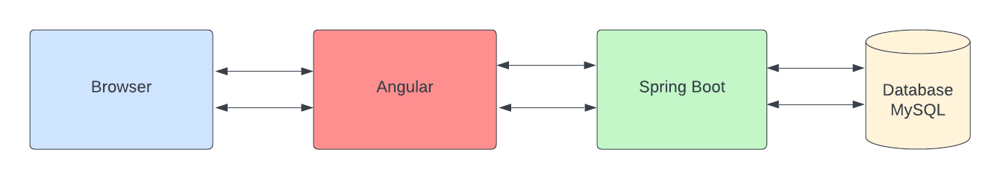
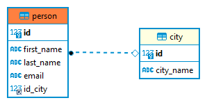

Pada seri tutorial ini kita akan membangun aplikasi *Fullstack* Spring Boot sebagai *backend* dan Angular sebagai *frontend*. Fullstack developer secara garis besar adalah seseorang yang bekerja atau merangkap tugas sebagai back end dan front end developer. Lebih spesifiknya, developer bisa bekerja dengan aplikasi backend seperti Javascript, PHP, Go, Java, Database (backend) dan juga bisa mengkonversi desain ke dalam kode pemrograman seperti HTML, CSS, XML, JSON (frontend).

<!--truncate-->

## Teknologi Yang Digunakan

Adapun teknologi yang digunakan adalah:

1. Spring Boot (backend)
2. Angular (frontend)
3. MySQL (database)

## Pengetahuan yang dibutuhkan

* Java Basic
* Spring Framework Basic
* Angular dasar
* Typescript & Javascript dasar
* HTML & CSS / Bootstrap

## Tools yang digunakan

Adapun tools yang digunakan pada tutorial ini:

* [OpenJDK 17](https://jdk.java.net/archive/)
* [Node Js & npm](https://nodejs.org/en/download/)
* Angular 13
* [Maven 3.8](https://maven.apache.org/download.cgi)
* [MySQL Database](https://www.mysql.com/downloads/)

Untuk IDE nya saya menggunakan (bisa menggunakan IDE lain sesuai selera):
* Intellij IDEA Community - untuk coding Spring Boot
* VS Code - untuk coding Angular

:::info
Silahkan install terlebih dahulu tools di atas (JDK, NodeJS, Maven dan database MySQL) beserta IDE-nya agar bisa mengikuti tutorial ini.
:::

## Proses Development

Adapun step-by-step proses development:

1. Menyiapkan Database
2. Membuat Aplikasi Spring Boot untuk Backend
	* Membuat Entity
	* Membuat Repository Data Access Object.
	* Menampilkan data REST.
3. Membuat Aplikasi Angular untuk Frontend
	* Membuat model.
	* Membuat component.
	* Membuat service.

## Arsitektur Aplikasi

Gambaran umum desain arsitektur aplikasi yang akan kita buat:



## Konfigurasi MySQL

Disini saya akan membuat database dengan nama `belajar`:

```sql
CREATE DATABASE belajar;

USE belajar;
```

Kemudian dalam praktek ini kita akan menyiapkan database dengan tabel `person` dan `city` yang akan berelasi one-to-many antara 2 tabel, dengan rancangan relasi seperti gambar di bawah ini.



Untuk datanya tidak usah kawatir, saya sudah menyiapkan file dump `sql` nya

Untuk tabel `city` :

```sql title="Tabel City"
DROP TABLE IF EXISTS `city`;
CREATE TABLE `city` (
  `id` int NOT NULL AUTO_INCREMENT,
  `city_name` varchar(100) CHARACTER SET utf8mb4 COLLATE utf8mb4_0900_ai_ci NOT NULL,
  PRIMARY KEY (`id`),
  KEY `course_id_IDX` (`id`) USING BTREE
) ENGINE=InnoDB AUTO_INCREMENT=6 DEFAULT CHARSET=utf8mb4 COLLATE=utf8mb4_0900_ai_ci;

LOCK TABLES `city` WRITE;

INSERT INTO `city` VALUES (1,'Jakarta'),(2,'Makassar'),(3,'Medan'),(4,'Surabaya'),(5,'Ambon');

UNLOCK TABLES;
```

Untuk tabel `person` dengan 50 record data:

```sql title="Tabel Person"
DROP TABLE IF EXISTS `person`;

CREATE TABLE `person` (
  `id` int NOT NULL AUTO_INCREMENT,
  `first_name` varchar(100) DEFAULT NULL,
  `last_name` varchar(100) DEFAULT NULL,
  `email` varchar(100) DEFAULT NULL,
  `id_city` int DEFAULT NULL,
  PRIMARY KEY (`id`),
  KEY `person_FK` (`id_city`),
  CONSTRAINT `person_FK` FOREIGN KEY (`id_city`) REFERENCES `city` (`id`)
) ENGINE=InnoDB AUTO_INCREMENT=51 DEFAULT CHARSET=utf8mb4 COLLATE=utf8mb4_0900_ai_ci;

LOCK TABLES `person` WRITE;

INSERT INTO `person` VALUES (1,'david','john','david@gmail.com',1),(2,'rogers','paul','rogerds@gmail.com',1),(3,'maria','sanders','maria@gmail.com',1),(4,'morris','miller','morris@gmail.com',1),(5,'azwar','anas','azwar@gmail.com',1),(6,'daniel','michael','daniel01@gmail.com',1),(7,'sanders','paul','sanders45@gmail.com',1),(8,'mark','mike','mark55@gmail.com',1),(9,'morgan','maria','morgan22@gmail.com',2),(10,'paul','miller','paul45@gmail.com',2),(11,'david','miller','david33@gmail.com',2),(12,'chrishaydon','bell','chrishaydon22@gmail.com',2),(13,'michael','brown','112michael@gmail.com',2),(14,'morgan','james','222morgan@gmail.com',2),(15,'rogers','chrishaydon','rogers34@gmail.com',2),(16,'morgan','wright','morgan2232@gmail.com',2),(17,'morgan','wright','morgan22223@gmail.com',2),(18,'david','ross','david222@gmail.com',2),(19,'maria','morgan','maria434@gmail.com',2),(20,'mike','bell','mike66@gmail.com',2),(21,'miller','michael','miller232@gmail.com',3),(22,'ross','rogers','ross56@gmail.com',3),(23,'brooks','mike','brooks232@gmail.com',3),(24,'miller','daniel','miller444@gmail.com',3),(25,'mike','wright','mike333@gmail.com',3),(26,'wright','smith','wright3242@gmail.com',3),(27,'david','morgan','david111@gmail.com',3),(28,'smith','bell','smith66868@gmail.com',3),(29,'paul','wright','paul456464@gmail.com',3),(30,'michael','james','michael6868@gmail.com',3),(31,'michael','sanders','michael55765@gmail.com',4),(32,'john','rivera','johnrrr44@gmail.com',4),(33,'paul','michael','paul33553@gmail.com',4),(34,'ross','mark','ross87989@gmail.com',4),(35,'brooks','smith','brooks223322@gmail.com',4),(36,'cooper','brown','cooper90909@gmail.com',4),(37,'ross','daniel','ross12121@gmail.com',4),(38,'cooper','miller','cooper6767@gmail.com',4),(39,'jenny','maria','jenny12121@gmail.com',4),(40,'paul','rivera','paul46646@gmail.com',4),(41,'maria','sanders','maria131313@gmail.com',5),(42,'bell','david','bell21242@gmail.com',5),(43,'rivera','cooper','rivera574754@gmail.com',5),(44,'mark','david','markwffw24@gmail.com',5),(45,'paul','cooper','paul56454@gmail.com',5),(46,'brooks','david','brooks53545@gmail.com',5),(47,'james','maria','james656@gmail.com',5),(48,'john','mark','john6786@gmail.com',5),(49,'rivera','jenny09','rivera121212@gmail.com',5),(50,'chrishaydon','sanders','chrishaydon21232@gmail.com',5);

UNLOCK TABLES;

```

Cek datanya untuk memastikan datanya sudah ada:

```sql
SELECT * FROM city;

SELECT * FROM person;
```

**Bersambung.....**
