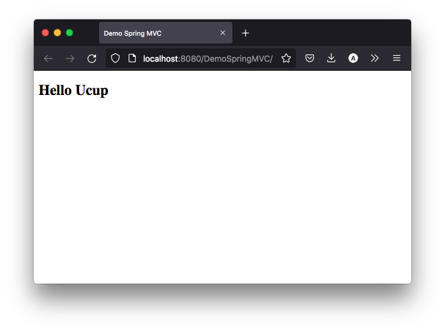

Eclipse adalah salah satu IDE favorit untuk membuat aplikasi Java, baik itu aplikasi standard maupun untuk skala Enterprise salah satunya membuat project Spring MVC. Salah satu kelebihannya karena lebih ringan dibanding IDE saingannya yaitu Intelij IDEA.

<!--truncate-->

Akan tetapi membuat project Spring MVC mungkin sedikit ribet bagi pemula. Ada beberapa konfigurasi yang diperlukan, berikut tutorial membuat aplikasi Spring MVC di Eclipse.

## Gunakan Eclipse versi Enterprise Java and Web

Ketika mendownload Eclipse halaman default pada [https://www.eclipse.org/downloads/](https://www.eclipse.org/downloads/), Eclipse versi ini berisi package untuk Eclipse for Java Developer yang berisi package standard untuk pemrograman Java Standard. Gunakan yang versi Eclipse Enterprise Java and Web di halaman [https://www.eclipse.org/downloads/packages/](https://www.eclipse.org/downloads/packages/). Kenapa menggunakan versi Enterpise Java and Web, karena plugin untuk pemrograman web di Java sudah tersedia dalam package versi Eclipse ini.

## Buat Project Dynamic Web Project

Buka Eclipse dan buat Project Dynamic Web Project.


Kemudian sesuaikan Project Name:


Struktur direktori Dynamic Web Project di Eclipse:


Selanjutnya kita convert projectnya ke Maven Project. Klik kanan pada project *Configure > Convert to Maven Project*.


Struktur direktori akan berubah menjadi struktur direktori maven.


### Konfigurasi pom.xml

Kita masukan dependency Spring MVC stadard, ubah konfigurasi `pom.xml` seperti di bawah ini:

```xml title=pom.xml
<project xmlns="http://maven.apache.org/POM/4.0.0" xmlns:xsi="http://www.w3.org/2001/XMLSchema-instance" xsi:schemaLocation="http://maven.apache.org/POM/4.0.0 https://maven.apache.org/xsd/maven-4.0.0.xsd">
	<modelVersion>4.0.0</modelVersion>
	<groupId>com.tutorialtimposu</groupId>
	<artifactId>DemoSpringMVC</artifactId>
	<version>0.0.1-SNAPSHOT</version>
	<packaging>war</packaging>
	<properties>
		<spring.version>5.3.18</spring.version>
	</properties>

	<dependencies>
		<dependency>
			<groupId>org.springframework</groupId>
			<artifactId>spring-context</artifactId>
			<version>${spring.version}</version>
		</dependency>
		<dependency>
			<groupId>org.springframework</groupId>
			<artifactId>spring-webmvc</artifactId>
			<version>${spring.version}</version>
		</dependency>
		<dependency>
			<groupId>org.springframework</groupId>
			<artifactId>spring-web</artifactId>
			<version>${spring.version}</version>
		</dependency>
		<dependency>
			<groupId>javax.servlet</groupId>
			<artifactId>jstl</artifactId>
			<version>1.2</version>
		</dependency>
		<dependency>
			<groupId>javax.servlet.jsp.jstl</groupId>
			<artifactId>jstl-api</artifactId>
			<version>1.2</version>
		</dependency>
	</dependencies>

	<build>
		<plugins>
			<plugin>
				<artifactId>maven-compiler-plugin</artifactId>
				<version>3.8.1</version>
				<configuration>
					<source>17</source>
					<target>17</target>
				</configuration>
			</plugin>
			<plugin>
				<artifactId>maven-war-plugin</artifactId>
				<version>3.2.3</version>
			</plugin>
		</plugins>
	</build>
</project>
```

### Konfigurasi web.xml

Masukan konfigurasi `web.xml` pada direktor `/WEB-INF/web.xml` seperti di bawah ini:

```xml title=web.xml
<?xml version="1.0" encoding="UTF-8"?>
<web-app xmlns:xsi="http://www.w3.org/2001/XMLSchema-instance"
	xmlns="http://xmlns.jcp.org/xml/ns/javaee"
	xsi:schemaLocation="http://xmlns.jcp.org/xml/ns/javaee http://xmlns.jcp.org/xml/ns/javaee/web-app_3_1.xsd"
	id="WebApp_ID" version="3.1">
	<display-name>DemoSpringMVC</display-name>
	<!-- Spring MVC Configs -->

	<!-- Step 1: Configure Spring MVC Dispatcher Servlet -->
	<servlet>
		<servlet-name>dispatcher</servlet-name>
		<servlet-class>org.springframework.web.servlet.DispatcherServlet</servlet-class>
		<init-param>
			<param-name>contextConfigLocation</param-name>
			<param-value>/WEB-INF/spring-mvc-demo-servlet.xml</param-value>
		</init-param>
		<load-on-startup>1</load-on-startup>
	</servlet>

	<!-- Step 2: Set up URL mapping for Spring MVC Dispatcher Servlet -->
	<servlet-mapping>
		<servlet-name>dispatcher</servlet-name>
		<url-pattern>/</url-pattern>
	</servlet-mapping>
</web-app>
```

Dari konfigurasi di atas kita harus membuat konfigurasi context nya di `/WEB-INF/spring-mvc-demo-servlet.xml`.

```xml title=spring-mvc-demo-servlet.xml
<?xml version="1.0" encoding="UTF-8"?>
<beans xmlns="http://www.springframework.org/schema/beans"
	xmlns:xsi="http://www.w3.org/2001/XMLSchema-instance"
	xmlns:context="http://www.springframework.org/schema/context"
	xmlns:mvc="http://www.springframework.org/schema/mvc"
	xsi:schemaLocation="
		http://www.springframework.org/schema/beans
    	http://www.springframework.org/schema/beans/spring-beans.xsd
    	http://www.springframework.org/schema/context
    	http://www.springframework.org/schema/context/spring-context.xsd
    	http://www.springframework.org/schema/mvc
        http://www.springframework.org/schema/mvc/spring-mvc.xsd">

	<!-- Step 3: Add support for component scanning -->
	<context:component-scan
		base-package="com.topekox.mvc" />

	<!-- Step 4: Add support for conversion, formatting and validation support -->
	<mvc:annotation-driven />

	<!-- Step 5: Define Spring MVC view resolver -->
	<bean
		class="org.springframework.web.servlet.view.InternalResourceViewResolver">
		<property name="prefix" value="/WEB-INF/view/" />
		<property name="suffix" value=".jsp" />
	</bean>
	
</beans>
```
Sesuaikan base package component nya disini saya buat `com.topekox.mvc` dan untuk bagian view nya saya buat di `/WEB-INF/view/` dengan ekstensi `jsp`.

### Buat Controller

Selanjutnya kita buat controller, tapi sebelumnya kita buat package `com.topekox.mvc`:

```java title=HomeController.java
package com.topekox.mvc;

import org.springframework.stereotype.Controller;
import org.springframework.ui.Model;
import org.springframework.web.bind.annotation.RequestMapping;

@Controller
public class HomeController {
	
	@RequestMapping(name = "/")
	public String home(Model model) {
		
		model.addAttribute("name", "Ucup");
		return "home";
	}

}
```

### Buat View

Buat file `home.jsp` di direktori `/WEB-INF/view/home.jsp`:

```html title=home.jsp
<%@ page language="java" contentType="text/html; charset=UTF-8"
    pageEncoding="UTF-8"%>
<!DOCTYPE html>
<html>
<head>
<meta charset="UTF-8">
<title>Demo Spring MVC</title>
</head>
<body>
	<h2>Hello ${name}</h2>
</body>
</html>
```

### Running

Review struktur direktori:


Running dengan Tomcat klik kanan pada project *Run As > Run on Server* kemudian pilih server tomcat server anda kemudian lihat di browser:



:::info
[Source Code](https://github.com/TutorialTimposu/tutorial-spring-from-blog/tree/main/SpringMVCEclipse)
:::
