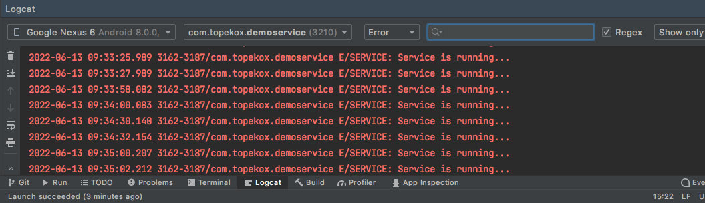
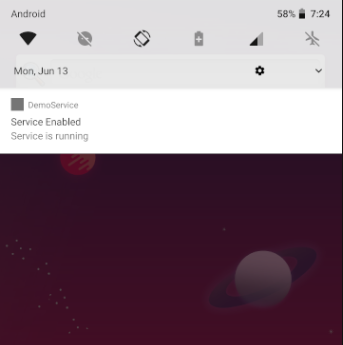

Service adalah proses yang berjalan dibelakang layar. Service tidak memiliki UI, tapi bekerja lebih ke-proses suatu pekerjaan. Untuk membuat service di Android, dulu sering dibuat menggunakan class `IntentService`. Namun, sayangnya class `IntentService` sudah di-deprecated. Tapi kita masih bisa menggunakan class `Service` secara manual, yang bisa digunakan menggunakan Background Service atau Foreground Service.

<!--truncate-->


## Background Service

Background Service digunakan untuk menjalankan Service di background, namun service ini akan mati ketika aplikasi kita dimatikan.

Cara membuatnya, yaitu buat sebuah class extends `Service` disini saya beri nama `MyBackgroundService.java` dan override method `onStartCommand`, dan buat `Thread` baru di dalam method tersebut.

```java title=MyBackgroundService.java
package com.topekox.demoservice;

import android.app.Service;
import android.content.Intent;
import android.os.IBinder;
import android.util.Log;

import androidx.annotation.Nullable;

public class MyBackgroundService extends Service {

    @Override
    public int onStartCommand(Intent intent, int flags, int startId) {
        new Thread(new Runnable() {
            @Override
            public void run() {
                while (true) {
                    Log.e("SERVICE", "Service is running...");
                    try {
                        Thread.sleep(2000);
                    } catch (InterruptedException e) {
                        e.printStackTrace();
                    }
                }
            }
        }).start();
        return super.onStartCommand(intent, flags, startId);
    }

    @Nullable
    @Override
    public IBinder onBind(Intent intent) {
        return null;
    }
}
```

Pada class di atas kita membuat Thread di dalam service yang akan di eksekusi setiap interval 2 detik. Selanjutnya daftarkan class Service tersebut ke dalam `AndroidManifest.xml`:

```xml
<service android:name=".MyBackgroundService"></service>
```

Kode lengkap `AndroidManifest.xml`:

```xml title=AndroidManifest.xml
<?xml version="1.0" encoding="utf-8"?>
<manifest xmlns:android="http://schemas.android.com/apk/res/android"
    xmlns:tools="http://schemas.android.com/tools"
    package="com.topekox.demoservice">

    <application
        android:allowBackup="true"
        android:dataExtractionRules="@xml/data_extraction_rules"
        android:fullBackupContent="@xml/backup_rules"
        android:icon="@mipmap/ic_launcher"
        android:label="@string/app_name"
        android:roundIcon="@mipmap/ic_launcher_round"
        android:supportsRtl="true"
        android:theme="@style/Theme.DemoService"
        tools:targetApi="31">
        <activity
            android:name=".MainActivity"
            android:exported="true">
            <intent-filter>
                <action android:name="android.intent.action.MAIN" />

                <category android:name="android.intent.category.LAUNCHER" />
            </intent-filter>
        </activity>
        <!-- Menambahkan Service -->
        <service android:name=".MyBackgroundService"></service>
    </application>

</manifest>
```

Panggil Service dari class Activity, contoh dipanggil dari class `MainActivity`:

```java
Intent intentService = new Intent(this, MyBackgroundService.class);
startService(intentService);
```

Gambar log ketika aplikasi dijalankan.



Service akan berhenti ketika aplikasi dimatikan.

## Foreground Service

Berbeda dengan Background Service, Foreground Service akan tetap berjalan meski aplikasi dimatikan.

Cara membuatnya hampir sama dengan cara sebelumnya hanya pada bagian class `MainActivity` yang berbeda.

Buat class extends `Service` disini saya beri nama `MyForegroundService.java` dan override method `onStartCommand`, dan buat `Thread` baru di dalam method tersebut.

```java title=MyForegroundService.java
package com.topekox.demoservice;

import android.app.Notification;
import android.app.NotificationChannel;
import android.app.NotificationManager;
import android.app.Service;
import android.content.Intent;
import android.os.Build;
import android.os.IBinder;
import android.util.Log;

import androidx.annotation.Nullable;
import androidx.annotation.RequiresApi;

public class MyForegroundService extends Service {

    @RequiresApi(api = Build.VERSION_CODES.O)
    @Override
    public int onStartCommand(Intent intent, int flags, int startId) {
        new Thread(new Runnable() {
            @Override
            public void run() {
                while (true) {
                    Log.e("SERVICE", "Service is running...");
                    try {
                        Thread.sleep(2000);
                    } catch (InterruptedException e) {
                        e.printStackTrace();
                    }
                }
            }
        }).start();

        return super.onStartCommand(intent, flags, startId);
    }

    @Nullable
    @Override
    public IBinder onBind(Intent intent) {
        return null;
    }
}
```

Daftar service dan permission `FOREGROUND_SERVICE` ke `AndroidManifest.xml`:

```xml title=AndroidManifest.xml
<?xml version="1.0" encoding="utf-8"?>
<manifest xmlns:android="http://schemas.android.com/apk/res/android"
    xmlns:tools="http://schemas.android.com/tools"
    package="com.topekox.demoservice">
    <!-- add permission -->
    <uses-permission android:name="android.permission.FOREGROUND_SERVICE"></uses-permission>

    <application
        ...
        <activity
           ...
        </activity>
        <!-- register service -->
        <service android:name=".MyForegroundService"></service>
        ...
    </application>

</manifest>
```

Panggil service di `MainActivity`, cuma disini sedikit berbeda karena di versi Android yang saya jalankan, saya harus memanggil annotation `@RequiresApi(api = Build.VERSION_CODES.O)` untuk masalah kompatibelitas, kurang lebih method `onCreate` seperti di bawah ini:

```java
@RequiresApi(api = Build.VERSION_CODES.O)
@Override
protected void onCreate(Bundle savedInstanceState) {
    super.onCreate(savedInstanceState);
    setContentView(R.layout.activity_main);

    Intent intentService = new Intent(this, MyForegroundService.class);
    
    if (Build.VERSION.SDK_INT >= Build.VERSION_CODES.O && intentService == null) {
        startForegroundService(intentService);
    } else {
        MainActivity.this.startService(intentService);
    }        
}
```

:::tip
Baca dokumentasi lengkap Foreground Service [di sini](https://developer.android.com/guide/components/foreground-services).
:::

### Menambahkan Notifikasi

Untuk menambahkan notifikasi `NotificationChannel` pada method `onStartCommand` di class ForegroundService:

```java title=MyForegroundService.java
@RequiresApi(api = Build.VERSION_CODES.O)
@Override
public int onStartCommand(Intent intent, int flags, int startId) {
    new Thread(new Runnable() {
        @Override
        public void run() {
            while (true) {
                Log.e("SERVICE", "Service is running...");
                try {
                    Thread.sleep(2000);
                } catch (InterruptedException e) {
                    e.printStackTrace();
                }
            }
        }
    }).start();

    final String CHANNEL_ID = "Foreground Channel ID";
    NotificationChannel channel = new NotificationChannel(
            CHANNEL_ID,
            CHANNEL_ID,
            NotificationManager.IMPORTANCE_LOW);

    getSystemService(NotificationManager.class).createNotificationChannel(channel);
    Notification.Builder notification = new Notification.Builder(this, CHANNEL_ID)
            .setContentText("Service is running")
            .setContentTitle("Service Enabled")
            .setSmallIcon(R.drawable.ic_launcher_background);

    startForeground(1001, notification.build());

    return super.onStartCommand(intent, flags, startId);
}
```

Kita juga memberikan kondisi agar service hidup jika sebelumnya tidak hidup, tambahkan kondisi di class `MainActivity`:

```java title=MainActivity.java
@RequiresApi(api = Build.VERSION_CODES.O)
@Override
protected void onCreate(Bundle savedInstanceState) {
    super.onCreate(savedInstanceState);
    setContentView(R.layout.activity_main);

    if (!foregroundServiceIsRunning()) {
        Intent intentService = new Intent(this, MyForegroundService.class);
        if (Build.VERSION.SDK_INT >= Build.VERSION_CODES.O && intentService == null) {
            startForegroundService(intentService);
        } else {
            MainActivity.this.startService(intentService);
        }
    }
}

private boolean foregroundServiceIsRunning() {
    ActivityManager activityManager =
            (ActivityManager) getSystemService(MainActivity.this.ACTIVITY_SERVICE);

    for (ActivityManager.RunningServiceInfo service :
            activityManager.getRunningServices(Integer.MAX_VALUE)) {
        if (MyForegroundService.class.getName().equals(service.service.getClassName())) {
            return true;
        }
    }
    return false;
}
```

Gambar Notifikasi:



### Service Always ON

Agar foreground service tetap berjalan walaupun Android telah direstart, buat sebuah class `BroadcastReceiver` untuk mengandle ini:

```java title=MyBroadcastReceiver.java
package com.topekox.demoservice;

import android.content.BroadcastReceiver;
import android.content.Context;
import android.content.Intent;
import android.os.Build;

import androidx.annotation.RequiresApi;

public class MyBroadcastReceiver extends BroadcastReceiver {

    @RequiresApi(api = Build.VERSION_CODES.O)
    @Override
    public void onReceive(Context context, Intent intent) {
        if (intent.getAction().equals(Intent.ACTION_BOOT_COMPLETED)) {
            Intent intentService = new Intent(context, MyForegroundService.class);
            context.startForegroundService(intentService);
        }
    }
}
```

Lalu tambahkan permission dan register intentnya di `AndroidManifest.xml`:

```xml
...
<uses-permission android:name="android.permission.RECEIVE_BOOT_COMPLETED"></uses-permission>
...
 <!-- register receiver -->
    <receiver android:name=".MyBroadcastReceiver"
        android:exported="true">
        <intent-filter>
            <action android:name="android.intent.action.BOOT_COMPLETED"></action>
        </intent-filter>
    </receiver>
...
```

Maka service akan tetap berjalan walau Android telah direstart.

:::info
[Full Source Code](https://github.com/TopekoX/sample-android-java/tree/main/DemoServiceBackgroundForeground).
:::
