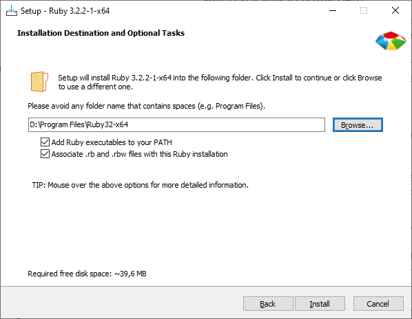
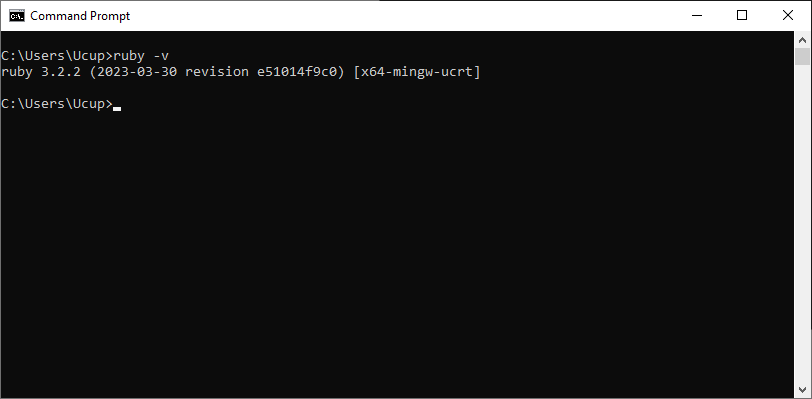
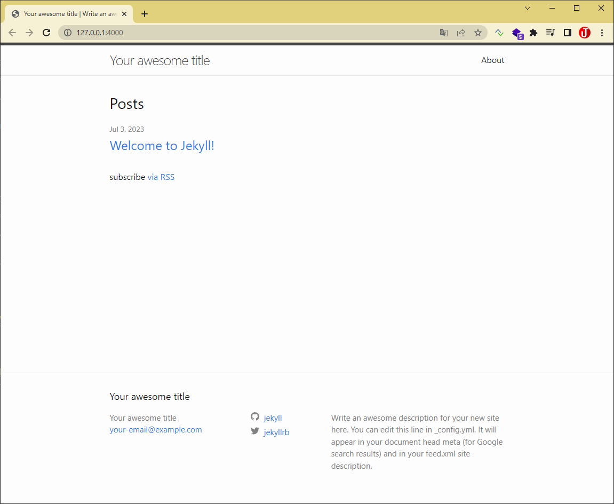

[Jekyll](https://jekyllrb.com/) adalah generator situs web statis, bisa digunakan untuk membuat blog bahkan web, yang diperuntukan untuk situs pribadi, proyek, atau organisasi. Jekyll ditulis dalam bahasa pemrograman Ruby oleh Tom Preston-Werner, Co-Founder GitHub, dan didistribusikan di bawah lisensi opensource. Dengan Jekyll kita bisa membuat blog dengan lebih simple, dan tidak membutuhkan database untuk menyimpan data karena.

Berikut ini beberapa fitur Jekyll:

<!--truncate-->


* __Simple__ Tidak membutuhkan database (kemungkinan untuk serangan sql injection tidak ada), moderasi komentar, atau pembaruan yang mengganggu untuk dipasang—hanya konten Anda.
* __Static Web__ Jekyll menggunakan Markdown, Liquid, termasuk HTML & CSS.
* __Blog aware__ Walaupun bersifat static fitur blog Permalinks, categories, pages, posts, dan custom layouts tetap ada. Anda tetap dapat mengubah tampilan dan layout, URL, data yang ditampilkan di halaman, dan lainnya.

:::info
Pada tutorial ini saya menggunakan system operasi Windows. Untuk OS lain silahkan menyesuaikan.
:::

# 1. Install Ruby

Jekyll berdiri diatas pemrograman Ruby jadi kita perlu install Ruby terlebuh dahulu. Jekyll membutuhkan Requirements sebagai berikut:

* [Ruby](https://www.ruby-lang.org/en/downloads/) version 2.5.0 atau yang terbaru
* RubyGems
* GCC & Make

1. [Download Ruby](https://www.ruby-lang.org/en/downloads/), disini saya menggunakan Ruby versi 3.2.2, untuk versi Windows bisa langsung [download installernya](https://rubyinstaller.org/), jangan lupa download yang versi Devkit.



Ikuti instruksinya sampai selesai, paket tambahan MSYS2 mungkin akan diinstall.


Jika MSYS2 sudah terinstall maka akan terbuka terminal seperti dibawah ini, selanjutnya kita akan melakukan instalasi Jekyll melalui terminal MSYS2 ini, untuk selengkapnya kalian bisa cek [instalasi MSYS2 dengan lengkap disini](https://www.msys2.org/).

2. Buka command prompt denganb mode __administrator__ cek apakah ruby sudah terinstal dengan perintah `ruby -v`



3. Cek juga RubyGem `gem -v`.
4. Cek GCC dan Make dengan perintah `gcc -v`,`g++ -v`, dan `make -v`

:::tip
Jika GCC & Make tidak terinstall dengan baik silahkan install [GCC](https://bobbyhadz.com/blog/gcc-is-not-recognized-as-an-internal-or-external-command#:~:text=The%20error%20%22'gcc'%20is,to%20your%20PATH%20environment%20variable.) dan [Make](https://bobbyhadz.com/blog/make-is-not-recognized-as-internal-or-external-command#:~:text=The%20error%20%22'make'%20is,Search%20bar%20and%20type%20PowerShell.) secara manual.
:::

# 2. Install Jekyll

Buka command prompt dengan mode __Administrator__.

Install Jekyll dan bundler gems

```bash
gem install jekyll bundler
```

# 3. Membuat blog

* Membuat website dengan Jekyll contoh misal namanya `blogsaya`

```bash
jekyll new blogsaya
```

* pindah kedalam folder blog

```bash
cd blogsaya
```

* Build web site dan jalankan melalui local server

```bash
bundle exec jekyll serve
```

* Buka url `http://127.0.0.1:4000/` di browser



* Blog Jekyll berhasil running. Selanjutnya kita tinggal memasukkan konten\

## Referensi

[https://jekyllrb.com/docs/](https://jekyllrb.com/docs/)